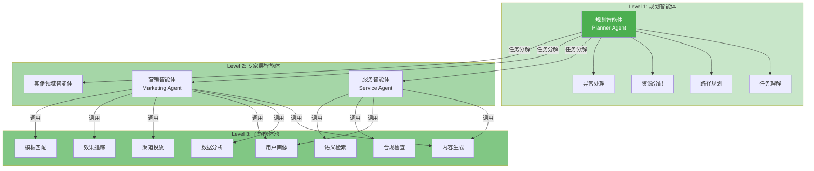
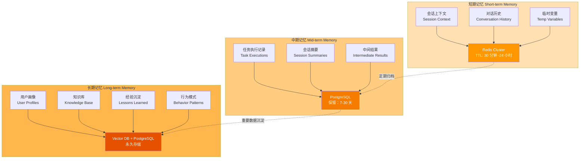
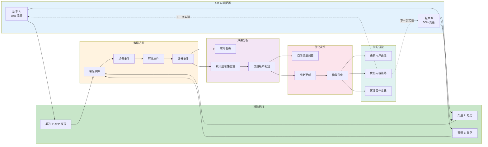
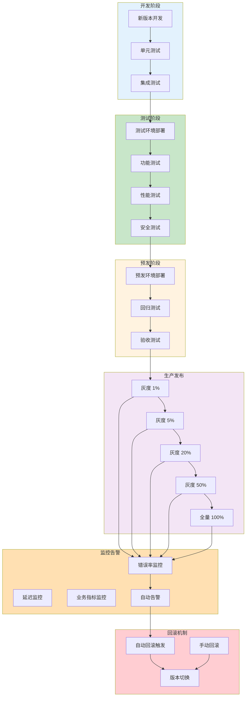
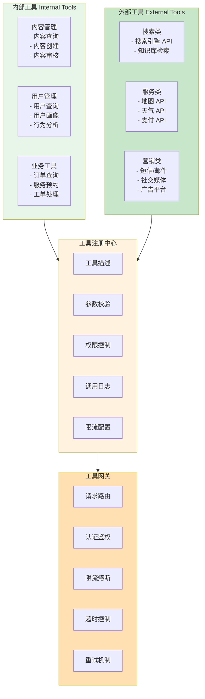
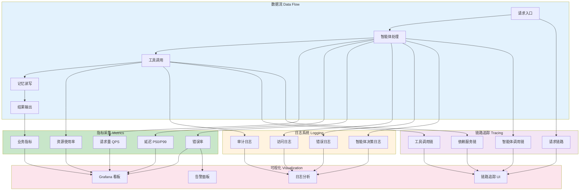
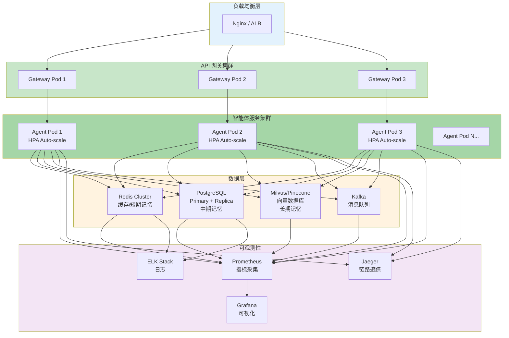

# 多智能体服务框架 - 架构图

## 图 1: 整体架构总览

	

---

## 图 2: 智能体层级与协同



---

## 图 3: 记忆存储架构



---

## 图 4: 任务执行流程

```mermaid
sequenceDiagram
    participant U as 用户/触发器
    participant G as 网关层
    participant S as 调度中心
    participant P as 规划智能体
    participant E as 专家层智能体
    participant W as 子智能体
    participant M as 记忆系统
    participant T as 工具集
    participant Q as 质量审核
    participant D as 投放服务
    participant F as 反馈系统
    
    U->>G: 1. 请求/事件触发
    G->>S: 2. 创建任务实例
    S->>P: 3. 执行规划
    
    P->>M: 4. 查询上下文
    M-->>P: 返回上下文
    P->>P: 5. 任务分解与路径规划
    
    par 并行执行子任务
        P->>E: 6a. 分配任务给专家层
        E->>W: 7a. 调用子智能体
        W->>T: 8a. 调用工具
        T-->>W: 返回结果
        W-->>E: 返回结果
        E-->>P: 返回结果
    and
        P->>E: 6b. 分配另一任务
        E->>W: 7b. 调用子智能体
        W->>T: 8b. 调用工具
        T-->>W: 返回结果
        W-->>E: 返回结果
        E-->>P: 返回结果
    end
    
    P->>Q: 9. 提交质量审核
    Q->>Q: 10a. 自动审核
    Q->>Q: 10b. 人工抽检 (10%)
    Q-->>P: 审核结果
    
    alt 审核通过
        P->>D: 11. 执行投放
        D->>U: 12. 内容触达用户
        U->>F: 13. 用户反馈 (点击/转化/评分)
        F->>M: 14. 存储反馈数据
        F->>P: 15. 反馈用于优化
    else 审核不通过
        P->>P: 11. 修订方案
        P->>Q: 重新提交审核
    end
    
    style U fill:#e3f2fd
    style P fill:#c8e6c9
    style Q fill:#fff3e0
    style F fill:#fce4ec
```

---

## 图 5: A/B 测试与反馈闭环



---

## 图 6: 服务版本管理与发布流程



---

## 图 7: 工具集架构



---

## 图 8: 数据流与可观测性



---

## 图 9: 部署架构



---

## 使用说明

1. **查看架构图**: 将上述 Mermaid 代码复制到支持 Mermaid 的编辑器中查看（如 GitHub、Notion、Mermaid Live Editor）
2. **在线预览**: 访问 https://mermaid.live 粘贴代码实时预览
3. **导出图片**: 在 Mermaid Live Editor 中可导出 PNG/SVG 格式
